# WorldWideWriters

Embrace your wanderlust and join World Wide Writers, a website where travel enthusiasts share their adventures and inspire others to explore the world. Here, you can create posts and save your favorite travel posts from fellow adventurers. Share travel itineraries, exchange recommendations, and start planning your next adventure! World Wide Writers acts as your personal travel companion, helping you plan and execute your dream adventures.

[View the live webpage here.](#)

## Project Goals

- Create a engaging community of travel enthusiasts.
- Encourage users to share their travel experiences, tips, and recommendations.
- Promote a positive and supportive environment where users can learn from each other.
- Provide a good resource for users to plan and preparing for their future travel.
- Making a user-friendly platform for creating, editing, and sharing travel posts.
- Having a continent category filtering for users to find relevant travel information.

### User Goals

- Create travel posts that document their journeys, share tips, and inspire others.
- Read engaging stories and learn from the experiences of others to discover new destinations and activities.
- Find travel guides and destination information to plan future trips.
- Utilize the website's filtering capabilities to find information about relevant continent.
- Discover hidden gems
- Compare prices, find deals, and book travel accommodations through other users recommendations.
- Save valuable travel posts for future reference and planning.
- Share their own experiences and recommendations to contribute to the website.

### Site Owner Goals

- Attract users who want's to create, share, and engage with travel content.
- Make users feel welcommed and inspired
- Become a resource for travel enthusiasts seeking inspiration and planning assistance
- Create a visually appealing website design that is easy to navigate and use.
- Implement responsive design to ensure optimal viewing across various devices.

# User Experience

### Target Audience

The target audience for World Wide Writers is people who are passionate about travel and enjoy sharing their experiences with others. It could be someone who enjoy the practice of writing good stories, someone who seek inspiration for there new adventure or just somebody who wants to learn about different cultures, destinations and plan for future travels.
To meet these requirements the website has full CRUD functionality, which means that a user can create a post, read their and others posts, update their post and delete their post. They can find inspiration in posts by others and share there experience by creating posts and plan their trips by saving posts from others to their profile.

### Agile Methodology

I worked on Agile Methodology through the project with Githubs project and issues feature. Githubs project board are serving a nice visual representaion for tracking the progress. Githubs issue feature have been used to represent respective user, their acceptance criteria, tasks and labels for prioritising. Each user story has their own label using the MoSCoW priotisation of Must Have, Should Have, Could Have and Won't Have. Bugs are also documented as issues to keep track of and resolve.

To view the projects progress, user stories and bugs, see the [Kanban board](https://github.com/users/KlaraMartinsson/projects/4)

### User Stories

User Experience (Visitor)

- [Appealing website (must-have)](https://github.com/KlaraMartinsson/WorldWideWriters/issues/11)
- [User friendly navigation (must-have)](https://github.com/KlaraMartinsson/WorldWideWriters/issues/2)
- [Continent menu (schould-have)](https://github.com/KlaraMartinsson/WorldWideWriters/issues/6)
- [Open a post (must-have)](https://github.com/KlaraMartinsson/WorldWideWriters/issues/10)
- [Search bar (could-have)](https://github.com/KlaraMartinsson/WorldWideWriters/issues/9)

User Engagement (Registered User)

- [Account registration (must-have)](https://github.com/KlaraMartinsson/WorldWideWriters/issues/10)
- [Manage own posts (must-have)](https://github.com/KlaraMartinsson/WorldWideWriters/issues/3)
- [Save posts (schould-have)](https://github.com/KlaraMartinsson/WorldWideWriters/issues/8)
- [Submitting comments (won't-have)](https://github.com/KlaraMartinsson/WorldWideWriters/issues/4)
- [User profile (should-have)](https://github.com/KlaraMartinsson/WorldWideWriters/issues/5)

Adminstration Management (Admin Moderator)

- [Manage posts and comments(must-have)](https://github.com/KlaraMartinsson/WorldWideWriters/issues/7)
  
### Database Design

This project used a postgresql database. **About the database and img of it!!**

# Design
I emphasized a consistent layout and design throughout the entire page.

### Colors
The colors of the website are important for shaping a good UX. This website are opted for a harmonious combination of blue and white.
The colors used creates a strong contrast between the text and the background, making the text easier to read. This contrast is particularly evident in the combination of white text on a blue background. This contrast makes the website more visually appealing and user-friendly. 

Color scheme was made at [coolors.co](https://coolors.co/)

### Fonts
The WorldWideWriters website are using the default fonts provided by Bootstrap due to its cleanness and readability.

### Images
The hero-image was made through [Canvas](https://www.canva.com/) design plattform. The images in the post are from my personal gallerie or from the website [Pexels](https://www.pexels.com/) with free usage rights images.

### Wireframes

# Features

### Home page

The home page has a nice blue layout with a big hero image stating quickly what the website is for. It also has an container with more information about the website and goes into detail what you can do. In that container there is a sign up and sign in button. If it is a registered user opening up the homepage it has buttons where the user can create post or see posts.

### Posts page

The post page are displaying all of the published posts by registred users, including the posts image, title, excerpt and author.

### Posts detail page

In the detailed post page, you can view the complete article, including the post's image, title, author, and creation date. As a registered user, you have the option to save the post to your profile for future reading. You also have the option to edit or delete the post if the author is the same as the user.

### Profile page

The profile page are only visual for registred users. Here they can see their posts and their saved posts. They also have the options to edit or delete their own posts.

### User Account Management

To manage accounts, there are sign-up/in and out pages. The sign-up form includes validation to ensure that accurate information is provided. The login form verifies that the username matches the password and other relevant credentials. The sign out page reassure that the user are sure about wanting to log out.

### Confirmation messages

To provide users with feedback and ensure good user experience, successful and unsuccessful actions will be accompanied by clear messages. For instance, upon successful registration, logging in, or logging out, a message will confirm the action and indicate the user's current status. Similarly, successful post creation, saving, or deletion will be accompanied by corresponding success messages.

### Navigation

Visitor:

The top navigation bar displays the following options:

- Posts: Link to the list of posts
- Continents: Menu to filter posts by continent
- Sign In: Link to the sign-in page
- Sign Up: Link to the sign-up page

In the homepage, visitors have the following buttons:

Sign In: Button to sign in to their account
Sign Up: Button to create a new account

Registered User:

The top navigation bar displays the following options:

- Posts: Link to the list of posts
- Continents: Menu to filter posts by continent
- Create Post: Link to the create post page
- Profile: Link to the user's profile page
- Sign Out: Link to the sign-out page

In the homepage, registered users have the following buttons:

Create Post: Button to create a new post
Posts: Link to the list of posts

Detailed Post Page:

In the detailed post page, users can easily go back to the posts page by clicking the Go Back button.

## Future adaptations

Some future adations the website could have are:

- A search bar, to make it easier for users to find what they are looking for.
- A comments feature, to engage more in the community.
- A possibilty to show other registered users profile page where they have an bio and all of their posts.
- A possibilty to message other users to ask questions.
- Collaborate with travel brands and organizations to offer exclusive deals and discounts to websites users.
- Enable a sharing feature to share posts over other social medias.
- Provide users with more control over their accounts by allowing them to change or reset their passwords and usernames."

# Issues and Bugs

### Known and unsolved bugs

- Can't create a post with the same title as an already existing post.
- The element tags are presenting when a admin is making a post through the admin page and try to edit it through the website.

### Fixed bugs

- When I made the screen size smaller the posts where overlapping the navbar so that user couldn't see the menu in the navbar. I solved it by inspecting the navbar through chrome and saw that I had a fixed height in my navbar that was making the issue. Solved it by deleting it. [See image](https://github.com/KlaraMartinsson/WorldWideWriters/issues/14)
- When I deployed to Heroku and tried to edit a post the element tags where showing. I forgot to use " | safe " in {{ post.content }}. [See image](https://github.com/KlaraMartinsson/WorldWideWriters/issues/13)
- When a registred user where trying to upload an image to a post the default image displayed instead of their own.
The bug:
When a registred user is trying to upload an image to a post the default image displays instead of their own. The uploaded image could not be found because it could not upload.
I solved this by requesting files in the PostForm.

def user_post(request):
post_form = PostForm()
if request.method == "POST":
post_form = PostForm(request.POST, request.FILES)

- Getting warnings about cloudinary not having a secure HTTPS. I fixed this by importing cloudinary to settings and making it secure by adding this code that I learned from other students on slack: 
  cloudinary.config(
    secure=True,
)

# Technologies Used

### Languages

- Python
- HTML5
- CSS3
- Django Template Language
- Markdown
  
### Frameworks

- Django: A web framework that uses high-level Python. To enable full stack development for this project.
- Crispy Forms: Django Crispy Forms is a Python application that made my forms more user-friendly and visually appealing..
- Bootstrap v5.0: Bootstrap is a framework to use for its easy responsiveness management tools and a lot more. I used it to make the website more available on all different screens and to reduce code work.
- Cloudinary: Cloudinary has been a great tool to manage the websites storing and serving of images. It is a cloud-based media management platform.
- ElephantSQL: Cloud based database storage.

### Tools

- GitHub: I used GitHud for repositories storage and Agile project management using Kanban boards/issue tracking.
- Codeanywhere: Used to store and write code.
- Heroku: Heroku is a cloud platform that I used for deployment to make this project into a live server.
- Canva:I used Canva for its design platform to make the header image.
- Font Awesome: Font Awesome is a website that generates icons. I used it for my save post icon and create post icon.

# Testing
The WorldWideWriters website been through a lot of manual testing by myself, friends, mentors and family.
This includes code validation, performance testing, cross-device testing, testing if user stories are completed and feedback messages for users.

#### Lighthouse result
A good result was presented on the desktop test.

Desktop

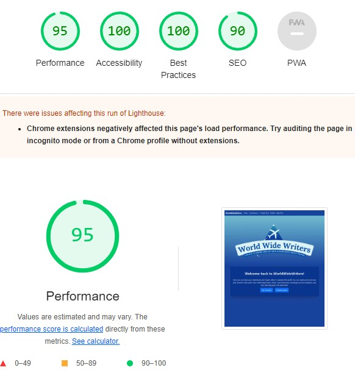

On Mobile the result was not as good as on desktop. It seems that the boostrap cdn causes the page to render slower on mobile.

Mobile

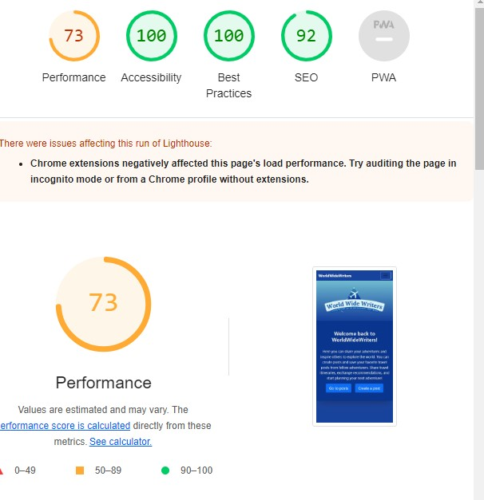

### Code Validation

#### HTML
All HTML code has passed through validation using [W3 Markup Validator](https://validator.w3.org/nu/) and shows no errors:

HTML Validation

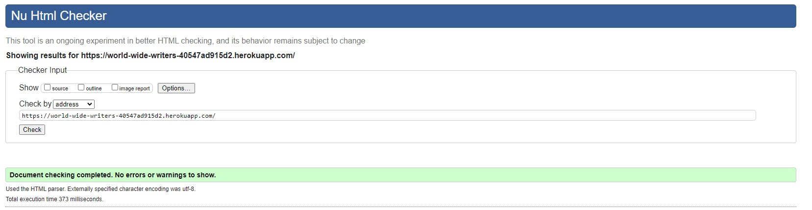

#### CSS

All CSS files has passed through validation using [Jigsaw Validator](https://jigsaw.w3.org/css-validator/) and shows no errors:

Whole page

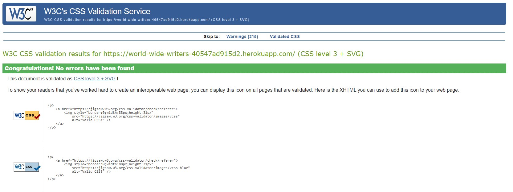

CSS file

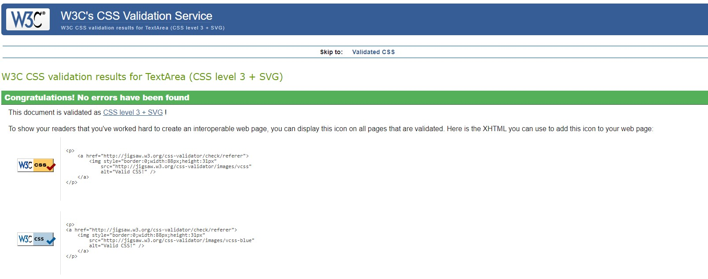

#### Python

All Python files has passed through validation using [Pep8](https://pep8ci.herokuapp.com/) and shows no errors:

world_wide_writers/settings.py

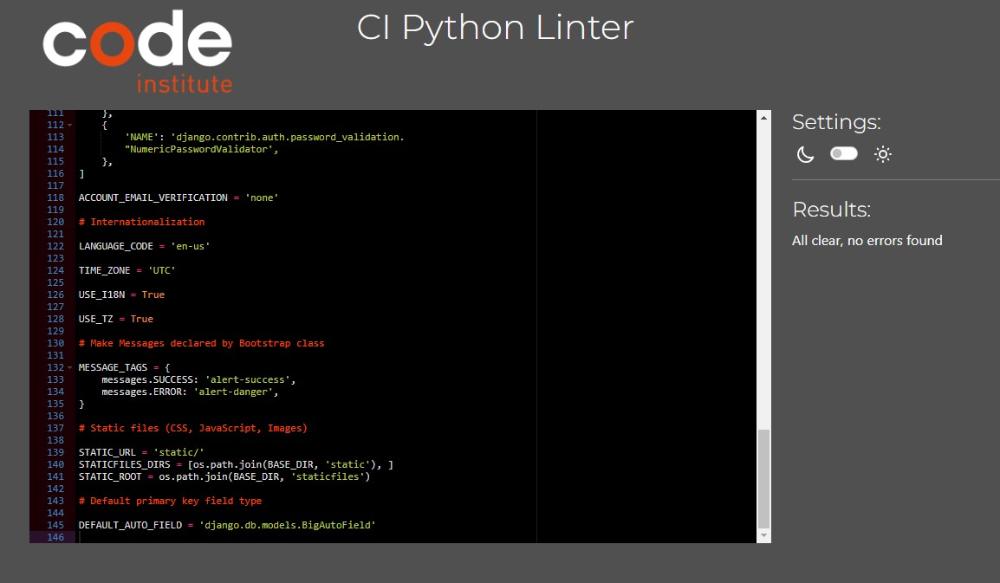

world_wide_writers/urls.py

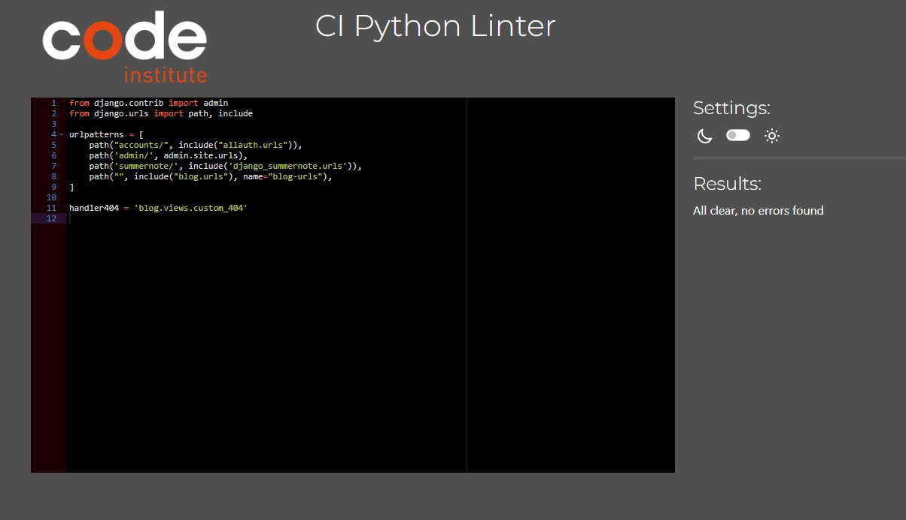

blog/models.py

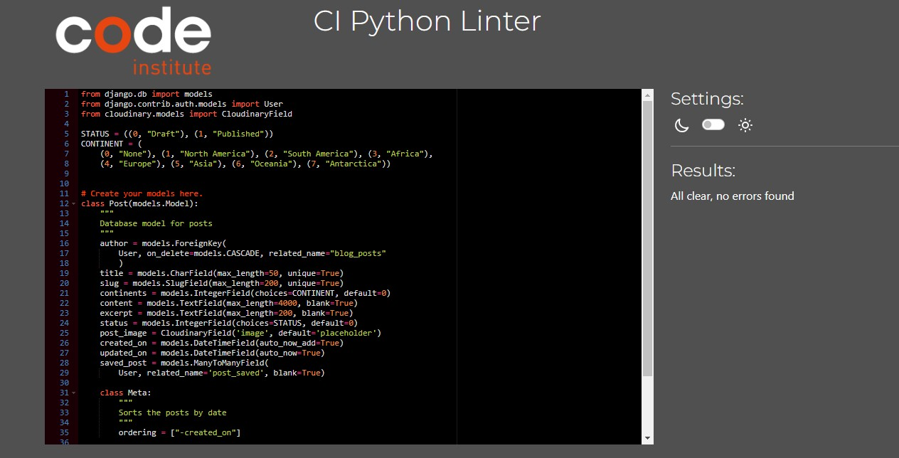

blog/forms.py

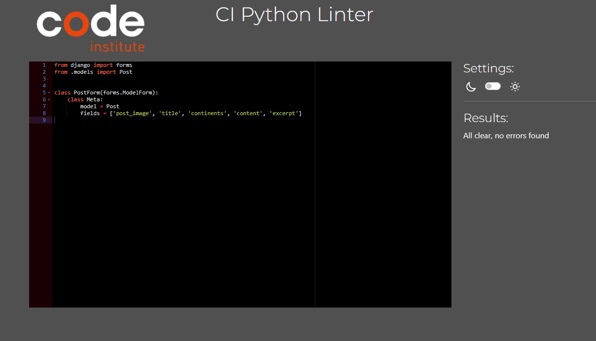

blog/views.py

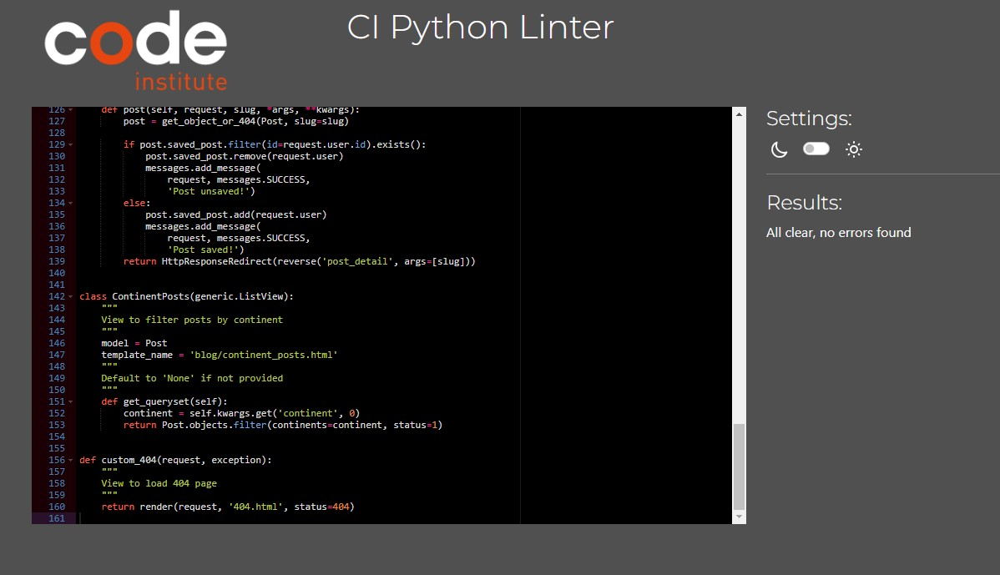

blog/urls.py

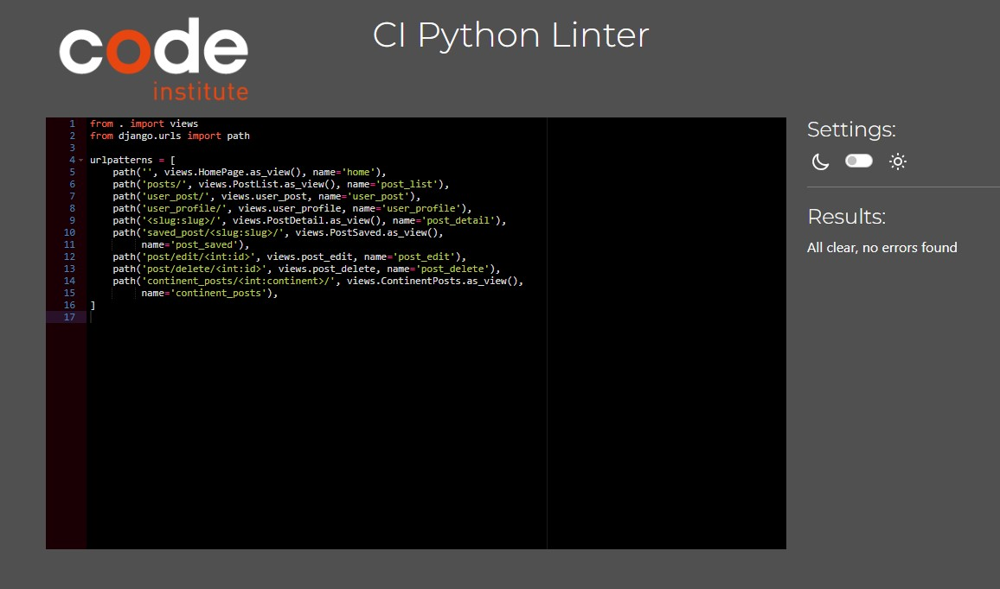

blog/admin.py

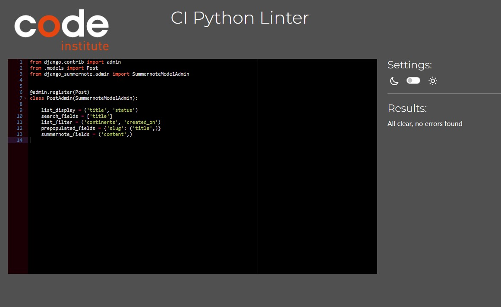

## Testing User Stories

Testing of the User stories for the project.
All User Stories can be found [Here](https://github.com/users/KlaraMartinsson/projects/4)

# Deployment

# Credits
