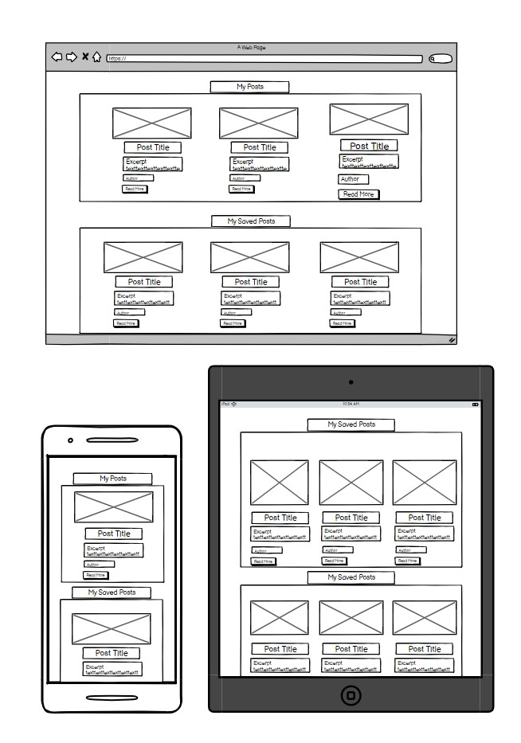
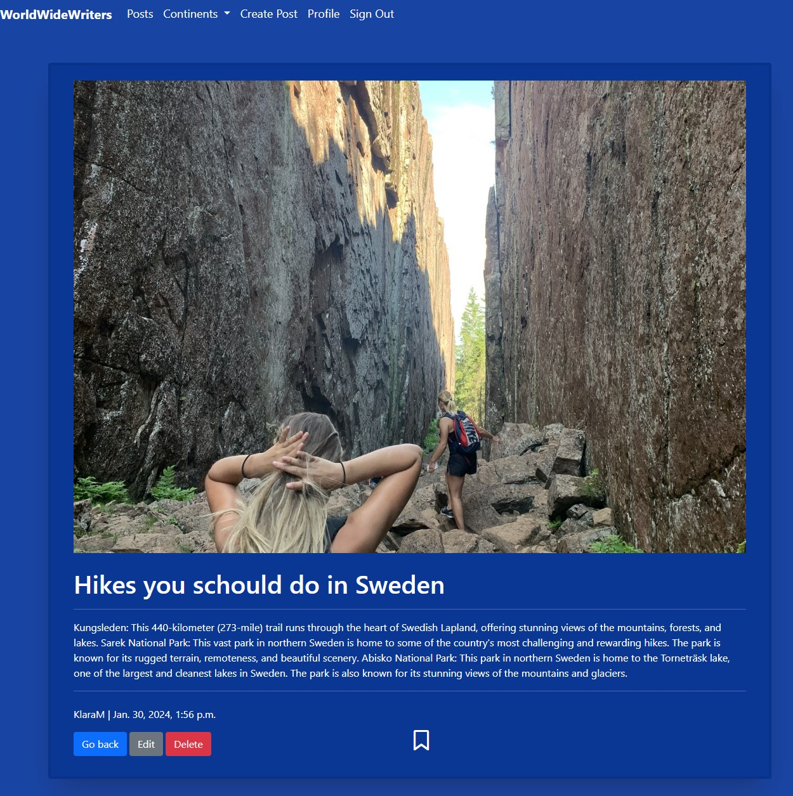
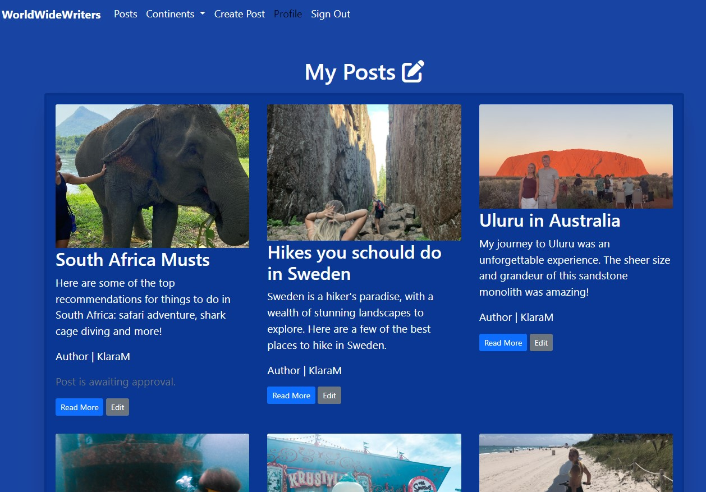
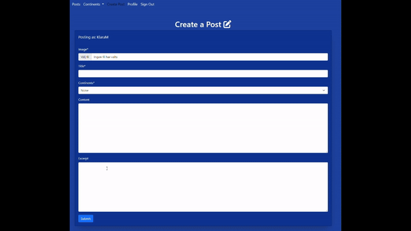

# WorldWideWriters

Embrace your wanderlust and join World Wide Writers, a website where travel enthusiasts share their adventures and inspire others to explore the world. Here, you can create posts and save your favorite travel posts from fellow adventurers. Share travel itineraries, exchange recommendations, and start planning your next adventure! World Wide Writers acts as your personal travel companion, helping you plan and execute your dream adventures.

[View the live webpage here.](https://world-wide-writers-40547ad915d2.herokuapp.com/)

## Project Goals

- Create a engaging community of travel enthusiasts.
- Encourage users to share their travel experiences, tips, and recommendations.
- Promote a positive and supportive environment where users can learn from each other.
- Provide a good resource for users to plan and preparing for their future travel.
- Making a user-friendly platform for creating, editing, and sharing travel posts.
- Having a continent category filtering for users to find relevant travel information.

### User Goals

- Create travel posts that document their journeys, share tips, and inspire others.
- Read engaging stories and learn from the experiences of others to discover new destinations and activities.
- Find travel guides and destination information to plan future trips.
- Utilize the website's filtering capabilities to find information about relevant continent.
- Discover hidden gems
- Compare prices, find deals, and book travel accommodations through other users recommendations.
- Save valuable travel posts for future reference and planning.
- Share their own experiences and recommendations to contribute to the website.

### Site Owner Goals

- Attract users who want's to create, share, and engage with travel content.
- Make users feel welcommed and inspired
- Become a resource for travel enthusiasts seeking inspiration and planning assistance
- Create a visually appealing website design that is easy to navigate and use.
- Implement responsive design to ensure optimal viewing across various devices.

# User Experience

### Target Audience

The target audience for World Wide Writers is people who are passionate about travel and enjoy sharing their experiences with others. It could be someone who enjoy the practice of writing good stories, someone who seek inspiration for there new adventure or just somebody who wants to learn about different cultures, destinations and plan for future travels.
To meet these requirements the website has full CRUD functionality, which means that a user can create a post, read their and others posts, update their post and delete their post. They can find inspiration in posts by others and share there experience by creating posts and plan their trips by saving posts from others to their profile.

### Agile Methodology

I worked on Agile Methodology through the project with Githubs project and issues feature. Githubs project board are serving a nice visual representaion for tracking the progress. Githubs issue feature have been used to represent respective user, their acceptance criteria, tasks and labels for prioritising. Each user story has their own label using the MoSCoW priotisation of Must Have, Should Have, Could Have and Won't Have. Bugs are also documented as issues to keep track of and resolve.

To view the projects progress, user stories and bugs, see the [Kanban board](https://github.com/users/KlaraMartinsson/projects/4)

### User Stories

User Experience (Visitor)

- [Appealing website (must-have)](https://github.com/KlaraMartinsson/WorldWideWriters/issues/11)
- [User friendly navigation (must-have)](https://github.com/KlaraMartinsson/WorldWideWriters/issues/2)
- [Continent menu (schould-have)](https://github.com/KlaraMartinsson/WorldWideWriters/issues/6)
- [Open a post (must-have)](https://github.com/KlaraMartinsson/WorldWideWriters/issues/10)
- [Search bar (could-have)](https://github.com/KlaraMartinsson/WorldWideWriters/issues/9)

User Engagement (Registered User)

- [Account registration (must-have)](https://github.com/KlaraMartinsson/WorldWideWriters/issues/1)
- [Manage own posts (must-have)](https://github.com/KlaraMartinsson/WorldWideWriters/issues/3)
- [Save posts (schould-have)](https://github.com/KlaraMartinsson/WorldWideWriters/issues/8)
- [Submitting comments (won't-have)](https://github.com/KlaraMartinsson/WorldWideWriters/issues/4)
- [User profile (should-have)](https://github.com/KlaraMartinsson/WorldWideWriters/issues/5)

Adminstration Management (Admin Moderator)

- [Manage posts and comments(must-have)](https://github.com/KlaraMartinsson/WorldWideWriters/issues/7)
  
### Database Design

In order to establish the database schema for this project I used dbdiagram.io website. This platform assisted me in planning and implement the database for the blog application.

#### Database Schema

- User Model:
  - user_id: A unique identifier for each user (Primary Key).
  - username: The username of the user.
  - email: The email the user.
  - password: The password of the user.

- Post Model: 
  - post_id: A unique identifier for each Post (Primary Key).
  - author: A foreign key reference to the User entity.
  - title: The title for the Post.
  - slug: The slug for the Post (generated with the title).
  - continents: The type of continent chosen for the Post
  - content: The Post's content.
  - status: A IntegerField keeping track of the status of the post, if it's published or a draft.
  - excerpt: A short text about the Post.
  - created_on: A DateTimeField indicating when the Post was created.
  - updated_on: A DateTimeField indicating when the Post was last edited.
  - post_image: The image representing the Post using the cloudinary platform.
  - saved_posts: A ManyToManyField keeping track of User's saved posts.

# Design
I emphasized a consistent layout and design throughout the entire page.

### Colors

The colors of the website are important for shaping a good UX. This website are opted for a harmonious combination of blue and white.
The colors used creates a strong contrast between the text and the background, making the text easier to read. This contrast is particularly evident in the combination of white text on a blue background. This contrast makes the website more visually appealing and user-friendly.

Color scheme was made at [coolors.co](https://coolors.co/)

### Fonts

The WorldWideWriters website are using the default fonts provided by Bootstrap due to its cleanness and readability.

### Images

The hero-image was made through [Canvas](https://www.canva.com/) design plattform. It was made to capture the attention of visitors and impart a comprehensive understanding of the websites purpose and offerings. The images in the post are from my personal gallery or from the website [Pexels](https://www.pexels.com/) with free usage rights images.

### Wireframes
Wireframes served as a skeletal structure for the website, enabling a clear visualization of its intended design and layout.
Wireframes where made at [Balsamiq](https://balsamiq.com/)

Home page

Posts page

Profile page

Create Post page

# Features

### Home page

The home page has a nice blue layout with a big hero image stating quickly what the website is for. It also has an container with more information about the website and goes into detail what you can do. In that container there is a sign up and sign in button. If it is a registered user opening up the homepage it has buttons where the user can create post or see posts.

Home page for registered users

Home page for visitors

### Posts page

The post page are displaying all of the published posts by registred users, including the posts image, title, excerpt and author.

Posts page

### Continent filtering page

Looks the same as the post page but is filtered by selected continent.

Continent page

### Posts detail page

In the detailed post page, you can view the complete article, including the post's image, title, author, and creation date. As a registered user, you have the option to save the post to your profile for future reading. You also have the option to edit or delete the post if the author is the same as the user.

Post detail page for registered users

Post detail page for visitors

### Profile page

The profile page are only visual for registred users. Here they can see their own posts and their saved posts. They also have the options to edit their own posts. If a post is still awaiting approval a faded message is saying that under the author line.

My posts

My saved posts

### User Account Management

To manage accounts, there are sign-up/in and out pages. The sign-up form includes validation to ensure that accurate information is provided. The login form verifies that the username matches the password and other relevant credentials. The sign out page reassure that the user are sure about wanting to log out.

Sign in

Sign up

Sign out

### Create post page

Create post for registered users

### Confirmation messages

To provide users with feedback and ensure good user experience, successful and unsuccessful actions will be accompanied by clear messages. For instance, upon successful registration, logging in, or logging out, a message will confirm the action and indicate the user's current status. Similarly, successful post creation, saving, or deletion will be accompanied by corresponding success messages.

Confirmation message

### Navigation

Visitor:

The top navigation bar displays the following options:

- Posts: Link to the list of posts
- Continents: Menu to filter posts by continent
- Sign In: Link to the sign-in page
- Sign Up: Link to the sign-up page

Navbar for visitors

In the homepage, visitors have the following buttons:

Sign In: Button to sign in to their account
Sign Up: Button to create a new account

Registered User:

The top navigation bar displays the following options:

- Posts: Link to the list of posts
- Continents: Menu to filter posts by continent
- Create Post: Link to the create post page
- Profile: Link to the user's profile page
- Sign Out: Link to the sign-out page

Navbar for registered users

Navbar on smaller devices

In the homepage, registered users have the following buttons:

Create Post: Button to create a new post
Posts: Link to the list of posts

Detailed Post Page:

In the detailed post page, users can easily go back to the posts page by clicking the Go Back button.

## Future adaptations

Some future adations the website could have are:

- A search bar, to make it easier for users to find what they are looking for.
- A comments feature, to engage more in the community.
- A possibilty to show other registered users profile page where they have an bio and all of their posts.
- A possibilty to message other users to ask questions.
- Collaborate with travel brands and organizations to offer exclusive deals and discounts to websites users.
- Enable a sharing feature to share posts over other social medias.
- Provide users with more control over their accounts by allowing them to change or reset their passwords and usernames."

# Issues and Bugs

### Known and unsolved bugs

These bugs have been found too late in the project, due to lack of time they will not be solved.

- Can't create a post with the same title as an already existing post.
- The element tags are presenting when a admin is making a post through the admin page and try to edit it through the website.
- When editing a post the image disappears and the user have to upload the image again.
- After publishing the post from admin the new lines disappears.
- Users can create posts without writing content and excerpt
- Users can create a post with only spaces in the title

### Fixed bugs

- When I made the screen size smaller the posts where overlapping the navbar so that user couldn't see the menu in the navbar. I solved it by inspecting the navbar through chrome and saw that I had a fixed height in my navbar that was making the issue. Solved it by deleting it. [See image](https://github.com/KlaraMartinsson/WorldWideWriters/issues/14)
- When I deployed to Heroku and tried to edit a post the element tags where showing. I forgot to use " | safe " in {{ post.content }}. [See image](https://github.com/KlaraMartinsson/WorldWideWriters/issues/13)
- When a registred user where trying to upload an image to a post the default image displayed instead of their own.
The bug:
When a registred user is trying to upload an image to a post the default image displays instead of their own. The uploaded image could not be found because it could not upload.
I solved this by requesting files in the PostForm.

def user_post(request):
post_form = PostForm()
if request.method == "POST":
post_form = PostForm(request.POST, request.FILES)

- Getting warnings about cloudinary not having a secure HTTPS. I fixed this by importing cloudinary to settings and making it secure by adding this code that I learned from other students on slack:
  cloudinary.config(
    secure=True,
)

# Technologies Used

### Languages

- Python
- HTML5
- CSS3
- Django Template Language
- Markdown
  
### Frameworks

- Django: A web framework that uses high-level Python. To enable full stack development for this project.
- Crispy Forms: Django Crispy Forms is a Python application that made my forms more user-friendly and visually appealing..
- Bootstrap v5.0: Bootstrap is a framework to use for its easy responsiveness management tools and a lot more. I used it to make the website more available on all different screens and to reduce code work.
- Cloudinary: Cloudinary has been a great tool to manage the websites storing and serving of images. It is a cloud-based media management platform.
- ElephantSQL: ElephantSQL is a PostgreSQL database as a service. It is ueed as a cloud based database storage for the application's data.

### Tools

- GitHub: I used GitHud for repositories storage and Agile project management using Kanban boards/issue tracking.
- Codeanywhere: Used to store and write code.
- Heroku: Heroku is a cloud platform that I used for deployment to make this project into a live server.
- Canva:I used Canva for its design platform to make the header image.
- Font Awesome: Font Awesome is a website that generates icons. I used it for my save post icon and create post icon.

# Testing

The WorldWideWriters website been through a lot of manual testing by myself, friends, mentors and family.
This includes code validation, performance testing, cross-device testing, testing if user stories are completed and feedback messages for users.

#### Lighthouse result

A good result was presented on the desktop test.

Desktop

On Mobile the result was not as good as on desktop. It seems that the boostrap cdn causes the page to render slower on mobile.

Mobile

### Code Validation

#### HTML

All HTML code has passed through validation using [W3 Markup Validator](https://validator.w3.org/nu/) and shows no errors:

HTML Validation

#### CSS

All CSS files has passed through validation using [Jigsaw Validator](https://jigsaw.w3.org/css-validator/) and shows no errors:

Whole page

CSS file

#### Python

All Python files has passed through validation using [Pep8](https://pep8ci.herokuapp.com/) and shows no errors:

world_wide_writers/settings.py

world_wide_writers/urls.py

blog/models.py

blog/forms.py

blog/views.py

blog/urls.py

blog/admin.py

## Testing User Stories

Testing of the User stories for the project.
All User Stories can be found [Here](https://github.com/users/KlaraMartinsson/projects/4)

1. User Experience (Visitor)

| **ID** | **User Story** |**As a..** | **Action/Expected result** | **Pass/Fail** |
|-------------|------------|---------------------|-------------------|-------------------|
| 11 | Appealing website. | As a site user I want to visit a visually appealing and user-friendly homepage so that I can enjoy being on the website. | The site user will visit a visually appealing and user-friendly homepage. The homepage should be easy to navigate and have a clear layout. As a result, the site user will enjoy being on the website and will be more likely to return and explore other pages. | :heavy_check_mark: |
| 2 | User Friendly Navigation. | As a site user I can navigate the webpage so that I can access what I'm looking for. | The site user will be able to navigate the webpage easily and quickly. The webpage should have a clear and intuitive navigation structure with a clear path to all the important pages. |:heavy_check_mark: |
| 14 | Continent menu. | As a site user I can click on a continent in the navigation bar so that I can read about the countries that interests me. | The site user will be able to click on a continent in the navigation bar and be taken to a page where they can read about the countries in that continent. | :heavy_check_mark: |
| 10 | Open a post. | As a site user I can click on a post so that I can read all of the text in it. | The site user will be able to click on a post and be taken to a page where they can read all of the text in it. The page should display the full text of the post, including any images | :heavy_check_mark: |
| 11 | Search bar. | As a site user I can search for the things I'm interested in so that it's easy to access and saves me time. | The site user will be able to search for the things they are interested in. | ❌ |

2. User Engagement (Registered User)

| **ID** | **User Story** |**As a..** | **Action/Expected result** | **Pass/Fail** |
|-------------|------------|---------------------|-------------------|-------------------|
| 1 | Account registration. | As a site user I can register an account so I can contribute and be a part of the community. | The site user will be able to easily and securely create an account on the website. | :heavy_check_mark: |
| 3 | Manage Own Posts. | As a registered user I can publish and manage my own posts so that I can share my knowledge and experience. | Registered users will have the ability to create, publish, and manage their own posts on the website. | :heavy_check_mark: |
| 8 | Save posts. | As a registered user I can save posts to my profile so that I have easy access to the things I'm interested in. | Registered users will be able to save posts to their profiles for easy reference and future access. | :heavy_check_mark: |
| 4 | Submitting Comments. | As a registered user I can submit comments so that I can engage in the post. | Registered users will be able to submit comments to posts, enabling them to engage and share their perspectives. | ❌ |
| 5 | User Profile. | As a registered user I can access my profile so that I can see and change my posts and see my saved posts |  Registered users will be able to access their profiles to view and edit their posts and access their saved posts. | :heavy_check_mark: |

3. Adminstration Management (Admin Moderator)

| **ID** | **User Story** |**As a..** | **Action/Expected result** | **Pass/Fail** |
|-------------|------------|---------------------|-------------------|-------------------|
| 7 | Manage posts and comments. | As a site admin I can read, organize, approve and delete emissions so that I can manage the websites content. | Site admins will have the ability to effectively manage the website's content by reviewing, organizing, approving, and deleting posts. | :heavy_check_mark: |

### Manual testing
Videos were converted to GIFs using [Ezgif](https://ezgif.com/video-to-gif?err=expired).

#### Navbar

#### Sign up/in/out

- Sign up

- Sign out/in

#### Post create

#### Post edit

#### Post delete

#### Save posts

#### Responsivness

- Homepage

- Create post

- Profile

# Deployment

# Credits

## Content 
The content from the website is by Googles [Ai Bard](https://bard.google.com/chat) chat.

## Media
I made the hero image using Canva. I took images for the posts from Pexels website.
I used Font Awesome to generate icons. I used it for my save post icon and create post icon. My favicon is made at [Formito](https://formito.com/tools/favicon).

## Code used
I used bootstraps template for creating the navbar. I also used bootstraps documentation to make a modal with a warning for deleting posts.

## Acknowledgementes
My family and friends for checking out the webpage on their screens and giving critic.
My mentor Seun for giving helpful advise about the design. Also my mentor Spencer for giving good advices, trying out the website and checking my code and readme. 
